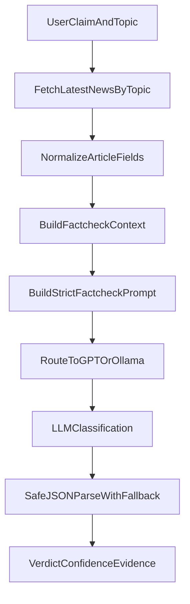
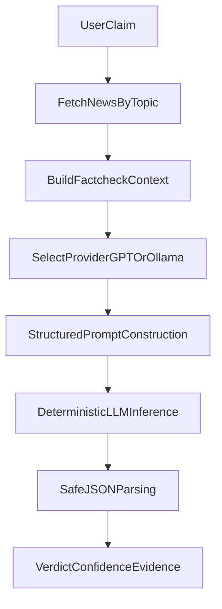

# FactLens (LLM-Powered)

FactLens is an evidence-grounded claim verification workflow built in the `NewsSummarizer` project folder.  
It fetches recent topic-specific news, builds a structured evidence context, and uses LLMs to classify a claim as `fact`, `fake`, or `uncertain`.

## Problem It Solves

Information spreads faster than verification.  
FactLens addresses this by combining live news retrieval with constrained LLM reasoning and structured outputs.

Instead of asking a model to "just decide," the system enforces:
- evidence-bounded evaluation
- deterministic inference settings
- typed output contract for machine-readable decisions

## End-to-End Pipeline

## Current Architecture in Code

### `NewsSummarizer/NewsSearch.py`
- retrieves latest topic news from NewsAPI
- validates environment key (`NEWS_ORG_API_KEY`)
- normalizes article schema (`title`, `source`, `published_at`, `url`, `description`, `content`)
- composes compact, evidence-oriented context text for LLM consumption

### `NewsSummarizer/LLMFactCheck.py`
- supports provider abstraction via `provider="gpt"` or `provider="ollama"`
- validates local model availability for Ollama before inference
- enforces structured JSON response format in prompt design
- keeps inference deterministic (`temperature=0`)
- safely parses JSON and degrades to `uncertain` on malformed model output

## Why This Reflects Mature LLM Engineering

### 1) Provider Abstraction
The same task logic can run on cloud APIs or local models.  
This enables cost/privacy/latency trade-off decisions without rewriting business logic.

### 2) Output Contracts Over Free Text
FactLens requests strict JSON output with fixed keys:
- `verdict`
- `confidence`
- `reasoning`
- `evidence_points`

This design makes integration with UIs, APIs, and evaluation pipelines much safer than plain-text responses.

### 3) Explicit Uncertainty Handling
The system allows `uncertain` when evidence is insufficient.  
This is critical in trust-sensitive domains where overconfident model behavior is harmful.

### 4) Guarded Parsing and Failure Recovery
`_safe_json_parse` prevents pipeline breakage from malformed outputs by returning a fallback structure.  
This is a production-minded reliability pattern.

### 5) Evidence-Bounded Prompting
Prompt instructions explicitly constrain reasoning to the fetched daily summary context.  
This reduces unsupported claims and encourages source-grounded decisions.

## Benefits and Impact

- **Misinformation resistance:** introduces a structured verification step before content acceptance.
- **Automation-ready output:** JSON verdicts can feed dashboards, alerts, and moderation tools.
- **Deployment flexibility:** choose GPT for quality/scale or Ollama for privacy/local control.
- **Low-friction extensibility:** easy to plug in better retrieval, ranking, or source credibility scoring.

## Learning Value for People New to LLM Systems

FactLens is a strong beginner-to-intermediate bridge because it teaches real system design, not only prompt demos.

What you learn:
- how retrieval and generation collaborate in evidence-based workflows
- why deterministic settings matter for repeatable outcomes
- how to build robust model wrappers with validation and fallbacks
- how to define output schemas for downstream machine consumption
- how to design responsible AI behavior with explicit uncertainty states

## Quick Start

1. Install dependencies:
   - `pip install -r requirements.txt`
2. Create `.env` with required keys:
   - `NEWS_ORG_API_KEY`
   - `OPENAI_API_KEY` (for GPT path)
3. For local inference path, ensure Ollama is running and model is available:
   - example model: `phi4-mini:latest`
4. Execute the script entry points or import functions in notebooks:
   - `fetch_latest_news_by_topic(...)`
   - `build_llm_factcheck_context(...)`
   - `fact_check_from_daily_summary(...)`

## Next-Level Enhancements

- add source credibility weighting (publisher trust score)
- rank evidence snippets by semantic relevance before prompting
- store historical verdicts for drift and consistency analysis
- add citation-level attribution in `evidence_points`
- evaluate model agreement across multiple providers for robustness

## Portfolio Positioning

FactLens can be presented as a **trust-oriented LLM application** that combines retrieval, constrained reasoning, and robust structured outputs to support safer decision-making in noisy information environments.
# FactLens (LLM-Powered)

FactLens is an LLM-powered claim verification system that grounds model judgments in live, topic-specific news evidence.  
The implementation lives in the `NewsSummarizer` folder and is intentionally designed as a practical bridge between research-style prompting and production-minded reliability.

## Problem It Solves

In fast-moving news cycles, users often evaluate claims with incomplete context.  
FactLens addresses this by:

- fetching the latest topic-relevant articles
- constructing evidence-rich context for an LLM
- producing structured fact-check outputs with explicit uncertainty behavior

## End-to-End Pipeline

## Technical Core (What Shows LLM Depth)

### 1) Evidence-bounded reasoning
Prompt instructions force the model to use only provided feed summary evidence and return `uncertain` when context is insufficient.  
This is a strong anti-hallucination pattern.

### 2) Provider abstraction
The same fact-check contract works across:

- OpenAI (`gpt`)
- local Ollama (`ollama`)

This is a practical multi-provider architecture that improves portability, resilience, and cost control.

### 3) Structured output contract
FactLens requires strict JSON with:

- `verdict` (`fact | fake | uncertain`)
- `confidence` (0-100)
- `reasoning`
- `evidence_points`

Structured outputs make results machine-consumable for dashboards, APIs, and audit logs.

### 4) Deterministic decoding for reliability
`temperature=0` is used to reduce output variance.  
For verification workflows, consistency is often more valuable than creativity.

### 5) Safe parsing fallback
If model output is malformed, the system gracefully falls back to a safe `uncertain` shape rather than crashing.  
This is reliability engineering, not just prompt engineering.

### 6) Local-first privacy option
Ollama support enables fully local inference with model availability checks, useful for sensitive workflows and offline experimentation.

## Why This Is More Than a Demo

FactLens includes production-relevant patterns that many beginner LLM projects miss:

- explicit failure handling
- schema-constrained generation
- provider swappability
- deterministic settings aligned with task type
- uncertainty as a first-class output

## Benefits This Project Can Deliver

- **Misinformation triage:** Quickly evaluate high-volume claims using evidence snapshots.
- **Decision support:** Provide structured verdicts and rationale for analysts and journalists.
- **Auditability:** Evidence points and confidence scores support traceable review.
- **Flexibility:** Run cloud or local models without redesigning your logic.

## Learning Value for Newcomers

FactLens is an excellent entry point into serious LLM application design.

A newcomer can learn:

- how to architect a full LLM pipeline, not just a single model call
- how to design prompts with enforceable output contracts
- why uncertainty handling is essential in factual domains
- how to combine external APIs, context construction, and LLM inference
- how to build local-vs-cloud model pathways responsibly

## Project Modules

- `NewsSearch.py`  
  Fetches latest articles by topic and builds compact fact-check context.

- `LLMFactCheck.py`  
  Builds structured prompts, routes providers, runs inference, and parses outputs safely.

- `NewsTitleRead.py`  
  Lightweight headline fetch script useful for quick feed checks.

## Quick Start

1. Add required keys in `.env`:
   - `NEWS_ORG_API_KEY`
   - `OPENAI_API_KEY` (if using GPT provider)
2. Install dependencies:
   - `pip install -r requirements.txt`
3. Run sample flow from:
   - `NewsSummarizer/LLMFactCheck.py`
4. Switch provider via:
   - `provider="gpt"` or `provider="ollama"`

## Future Enhancements

- source credibility weighting
- article-level citation mapping in final verdicts
- ensemble voting across multiple models
- temporal consistency checks across evolving stories
- benchmark suite with labeled claims

## Core Insight

FactLens demonstrates an advanced but essential LLM principle: **trustworthy AI outputs come from constrained reasoning, structured interfaces, and explicit uncertainty, not from larger prompts alone**.
