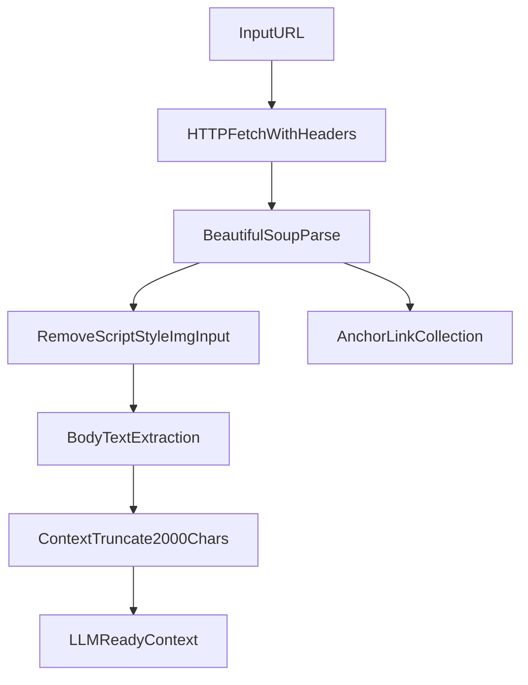
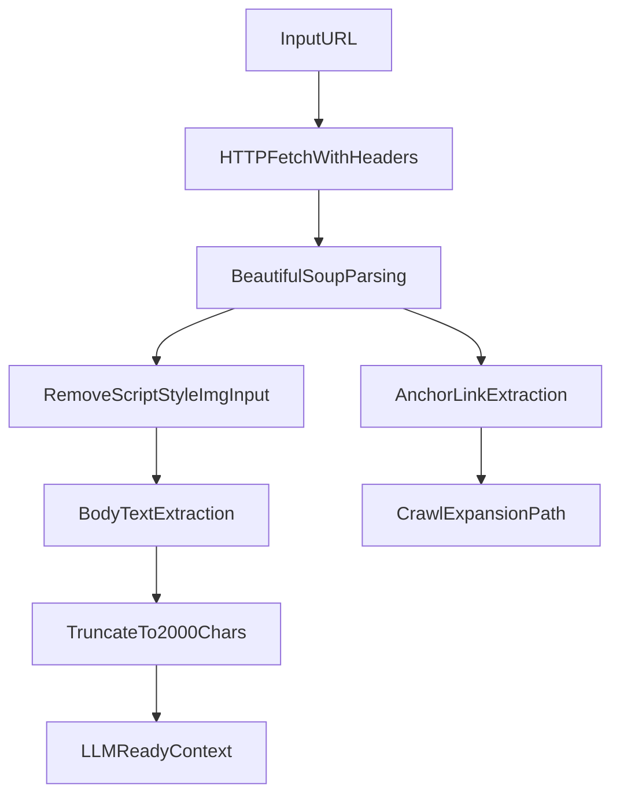

# QwikSummarizer

QwikSummarizer is a lightweight, LLM-ready summarization foundation that turns noisy web pages into clean, compact context for downstream language model tasks.  
The project focuses on a practical truth: LLM output quality is strongly limited by input quality.  

## Why This Project Matters

Most summarization demos skip the hard part: collecting reliable source text from real webpages.  
QwikSummarizer solves that ingestion layer so models can reason over cleaner evidence.

It is intentionally simple in surface area, but strong in data-prep fundamentals:
- deterministic extraction over dynamic prompt magic
- removal of irrelevant DOM noise before tokenization
- bounded context length to control cost and latency
- reusable output for summarization, QA, retrieval, and fact workflows

## System Workflow

## What Is Implemented

Core implementation lives in `QwikSummarizer/scraper.py`.

- `fetch_website_contents(url)`
  - uses realistic browser headers to reduce blocked requests
  - parses HTML with `BeautifulSoup`
  - strips non-semantic elements (`script`, `style`, `img`, `input`)
  - extracts readable body text with newline separation
  - truncates to 2,000 characters for prompt-budget control
- `fetch_website_links(url)`
  - parses anchor tags and returns cleaned `href` values
  - provides a crawl-ready primitive for multi-page summarization

## LLM Engineering Concepts Demonstrated

### 1) Context Shaping Before Prompting
The pipeline improves model accuracy by cleaning text *before* generation.  
This is a key production pattern: model orchestration cannot compensate for poor evidence formatting.

### 2) Token Budget and Cost Control
The 2,000-character cap is a practical context budget heuristic.  
For batch summarization pipelines, controlling input size is essential for predictable latency and spend.

### 3) Retrieval-First Thinking
By separating extraction and link collection, the project naturally supports a retrieval loop:
- fetch source page
- collect links
- select relevant pages
- synthesize a grounded summary

## Real-World Benefits

- **Faster content understanding:** compress long web pages into model-ready context quickly.
- **Higher signal quality:** reduces hallucination risk by removing presentation-only HTML noise.
- **Reusable preprocessing unit:** plugs into chatbots, research assistants, and topic monitors.
- **Scalable architecture seed:** forms the ingestion layer for RAG and evidence pipelines.

## Learning Value for Newcomers

If you are new to LLM systems, this project teaches core habits that many tutorials miss:

- data preprocessing is part of model quality, not a separate concern
- deterministic extraction can outperform complex prompting on messy inputs
- context size management is both an engineering and product decision
- modular design (`extract`, `collect links`) makes later LLM upgrades easier

## Quick Start

1. Install dependencies from the project root:
   - `pip install -r requirements.txt`
2. Run from Python:
   - import `fetch_website_contents` and `fetch_website_links`
3. Pass extracted text into your summarizer model or notebook flow.

## Suggested Next Upgrades

- add URL normalization and domain filtering for safer crawling
- de-duplicate links and remove tracking parameters
- chunk extracted text for long-form summarization
- add source citation mapping (sentence -> originating URL)
- integrate embedding-based relevance filtering before LLM calls

## Portfolio Positioning

QwikSummarizer is best presented as an **LLM input engineering module**:  
a robust preprocessing stage that improves downstream summarization quality, consistency, and cost-efficiency.
# QwikSummarizer

QwikSummarizer is a lightweight, LLM-ready web intelligence project that converts raw webpages into clean, structured context for downstream summarization and analysis.  
It focuses on one core engineering idea: **high-quality input creates high-quality LLM output**.

## Why This Project Matters

Most LLM failures in summarization are not model failures, they are data preparation failures.  
QwikSummarizer solves that by:

- removing noisy DOM elements that hurt signal quality
- extracting a compact, token-friendly content representation
- collecting page links for iterative retrieval and expansion

This gives you a fast base for building:

- automated research assistants
- topic digest generators
- source-aware summarization tools

## Architecture Overview

The project currently centers on `scraper.py`, where content preparation is deterministic and transparent.

## Deep LLM Engineering Concepts Demonstrated

### 1) Context shaping before inference
The code strips non-semantic elements (`script`, `style`, `img`, `input`) before text extraction, reducing irrelevant tokens and improving prompt clarity.

### 2) Token budget awareness
The 2,000-character cap is an explicit context-budget constraint.  
This mirrors production LLM design, where context limits and cost/latency trade-offs are first-class concerns.

### 3) Retrieval-first architecture
Link extraction creates a natural path to multi-page retrieval.  
This is the stepping stone from simple summarization to retrieval-augmented pipelines.

### 4) Deterministic preprocessing
The same URL produces stable preprocessing behavior, which is critical for reproducibility in LLM experiments.

## Benefits This Project Can Deliver

- **Faster prototyping:** Start summarization experiments without building a full crawler stack.
- **Better summary quality:** Cleaner text context improves factual alignment and reduces hallucination pressure.
- **Lower inference cost:** Smaller, denser prompts reduce token usage.
- **Extensible foundation:** Easy to evolve into RAG, topic tracking, or news intelligence workflows.

## Learning Path for Newcomers to LLMs

QwikSummarizer is a practical first project because it teaches the upstream side of AI systems, not only model APIs.

By studying or extending this project, a beginner learns:

- how raw web content differs from LLM-usable content
- why preprocessing quality strongly affects model reliability
- how to design small but meaningful constraints (like context truncation)
- how to prepare for retrieval-augmented generation with link graphs

## Quick Start

1. Install dependencies:
   - `pip install -r requirements.txt`
2. Run and test the scraper functions from:
   - `QwikSummarizer/scraper.py`
3. Feed returned content into your preferred LLM prompt for summary generation.

## Suggested Next Upgrades

- configurable chunking instead of fixed truncation
- URL normalization and domain filtering
- async fetching for speed
- metadata enrichment (author, publish time, section)
- confidence scoring over extracted content quality

## Project Philosophy

QwikSummarizer proves a key LLM engineering principle: **the strongest model cannot rescue weak context**.  
Build the context layer well, and every downstream model gets better.
