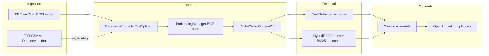

# RAG Project

An educational end-to-end **Retrieval-Augmented Generation (RAG)** pipeline built with LangChain, local sentence-transformer embeddings, ChromaDB, OpenAI Chat Completions, and optional **BM25 + semantic hybrid** retrieval for factual questions.

The primary implementation lives in [`notebook/CompleteRAGPipeline.ipynb`](notebook/CompleteRAGPipeline.ipynb). [`main.py`](main.py) is a placeholder entry point until classes are extracted into a `src/` package.

---

## Features

| Area | What is covered |
|------|-----------------|
| **Documents** | LangChain `Document` (`page_content` + `metadata`) |
| **Loaders** | `TextLoader`, `DirectoryLoader` (`.txt`, `.csv`), `PyMuPDFLoader` (PDF) |
| **Chunking** | `RecursiveCharacterTextSplitter` (default 300 chars, 150 overlap) |
| **Embeddings** | `sentence-transformers` — `BAAI/bge-base-en-v1.5` (768 dimensions) |
| **Vector DB** | ChromaDB persistent store at `data/vector_db` |
| **Semantic retrieval** | Query embedding → cosine distance → similarity score |
| **Hybrid retrieval** | BM25Okapi + semantic fusion with tunable weights |
| **Generation** | OpenAI Chat Completions with context-grounded prompts |
| **Quality checks** | PDF extraction inspection, chunk preview, retrieval A/B tests |

---

## Architecture



### Data flow

1. **Ingest** — Load files into LangChain documents (one row per CSV row; one page per PDF page).
2. **Chunk** — Split long text with overlap so sentences are not cut arbitrarily when possible.
3. **Embed** — Encode each chunk with BGE-base-en-v1.5.
4. **Index** — Persist vectors + text + metadata in ChromaDB.
5. **Retrieve** — Semantic search and/or hybrid BM25+semantic ranking.
6. **Generate** — Pass top chunks as context to the LLM and return an answer.

### Design decisions

| Decision | Choice | Rationale |
|----------|--------|-----------|
| Embedding model | `BAAI/bge-base-en-v1.5` | Stronger paraphrase and long-context behavior than small models (e.g. MiniLM) |
| Vector store | ChromaDB (persistent) | Simple local development; stores metadata per chunk |
| Default retrieval | Semantic (`RAGRetriever`) | Good for conceptual / paraphrased questions |
| Factual retrieval | Hybrid (`HybridRAGRetriever`) | Exact tokens (phone numbers, company names, dates) |
| Chunk defaults | 300 / overlap 150 | Balance between context size and granularity for document-style PDFs |

---

## Repository layout

```
RAG_Project/
├── notebook/
│   └── CompleteRAGPipeline.ipynb   # Main RAG implementation
├── data/
│   ├── text_files/                 # Sample .txt documents
│   ├── processed_data/             # CSV/TXT experiments (Phase 1)
│   ├── pdf/                        # PDF source documents
│   └── vector_db/                  # Chroma persistence (generated at runtime)
├── requirements.txt
├── pyproject.toml
├── main.py                         # Stub; run the notebook for RAG
└── README.md
```

---

## Setup

### Requirements

- Python **3.11+** (see `.python-version` and `pyproject.toml`)
- An [OpenAI API key](https://platform.openai.com/) for answer-generation cells

### Install

```bash
cd RAG_Project
python -m venv .venv
.venv\Scripts\activate          # Windows
# source .venv/bin/activate     # macOS/Linux
pip install -r requirements.txt
```

The first run downloads the embedding model (`BAAI/bge-base-en-v1.5`) via Hugging Face.

### Environment

Create a `.env` file in the project root:

```env
OPENAI_API_KEY=your_key_here
```

The notebook uses `python-dotenv` to load this variable.

### Run

1. Start Jupyter from the project root.
2. Open `notebook/CompleteRAGPipeline.ipynb`.
3. Execute cells **in order** (kernel cwd should be `notebook/` so `../data/...` paths resolve).
4. Place PDFs in `data/pdf/` before the Phase 2 cells.

---

## Pipeline phases (notebook)

### Phase 1 — Document ingestion

- Build sample `.txt` files under `data/text_files/`.
- Demonstrate `TextLoader`, `DirectoryLoader`, and `CSVLoader` on `data/processed_data/`.
- Explores how metadata (e.g. `source`, CSV `row`) travels with each chunk.

### Phase 2 — PDF RAG

| Step | Component | Description |
|------|-----------|-------------|
| Load | `PyMuPDFLoader` | Extract text per PDF page |
| Debug | `pypdf` inspection | Verify extraction quality before indexing |
| Chunk | `create_chunks()` | `RecursiveCharacterTextSplitter` |
| Embed | `EmbeddingManager` | Batch encode chunk text |
| Store | `VectorStore` | Add to ChromaDB collection `pdf_documents` |
| Retrieve | `RAGRetriever` | Semantic top-k with optional similarity threshold |
| Answer | `rag_simple()` | Retrieve → prompt → OpenAI |
| Hybrid | `HybridRAGRetriever` | BM25 + semantic score fusion |

---

## Configuration reference

| Parameter | Default | Location |
|-----------|---------|----------|
| `chunk_size` | `300` | `create_chunks()` |
| `chunk_overlap` | `150` | `create_chunks()` |
| `collection_name` | `pdf_documents` | `VectorStore` |
| `persist_directory` | `../data/vector_db` | `VectorStore` |
| `top_k` | `5` (retriever), `3` (`rag_simple`) | `retrieve()` / `rag_simple()` |
| `similarity_threshold` | `0.0` | `RAGRetriever.retrieve()` |
| `bm25_weight` | `0.4` | `HybridRAGRetriever.retrieve()` |
| `semantic_weight` | `0.6` | `HybridRAGRetriever.retrieve()` |
| LLM model | `gpt-5.4-nano` | `rag_simple()` / `OpenAILLM` |
| Embedding model | `BAAI/bge-base-en-v1.5` | `EmbeddingManager` |

After changing the **embedding model** or **chunking strategy**, call `vectorstore.reset_collection()` and re-run the indexing cells.

---

## Hybrid retrieval guide

Pure semantic search can miss **exact factual tokens** (phone numbers, employer names, IDs). Hybrid search combines:

- **BM25** — keyword overlap (good for rare proper nouns and numbers).
- **Semantic** — embedding similarity (good for paraphrased questions).

**Combined score:** `combined = bm25_weight × bm25_norm + semantic_weight × semantic_score`

| Query type | Suggested weights | Example |
|------------|-------------------|---------|
| Company / employment / exact names | BM25 `0.6–0.7`, semantic `0.3–0.4` | “Did X work at Company Y?” |
| Contact details (phone, email) | BM25 `0.7`, semantic `0.3` | “What is the phone number?” |
| Skills / concepts / summaries | BM25 `0.2–0.3`, semantic `0.7–0.8` | “What cloud platforms are listed?” |
| General Q&A | BM25 `0.4`, semantic `0.6` (defaults) | Mixed questions |

Use `rag_simple(query, hybrid_rag_retriever, llm)` the same way as with `rag_retriever`.

---

## Example questions

These illustrate what the pipeline is designed to answer (use your own documents in `data/pdf/`):

- Employment history (“Which organizations appear in the experience section?”)
- Skills and certifications (“What data platforms are mentioned?”)
- Contact information (hybrid search recommended)
- Education and dates

Compare `RAGRetriever` vs `HybridRAGRetriever` on the same query to see ranking differences in the notebook test cells.

---

## Core classes (notebook)

| Class / function | Role |
|------------------|------|
| `create_chunks()` | Split documents for indexing |
| `EmbeddingManager` | Load model and encode text batches |
| `VectorStore` | ChromaDB persistence and `add_documents()` |
| `RAGRetriever` | Semantic search with threshold filtering |
| `HybridRAGRetriever` | BM25 + semantic fusion |
| `OpenAILLM` | Prompt template + OpenAI client wrapper |
| `rag_simple()` | Minimal retrieve-then-generate pipeline |

---

## Limitations and future work

- **Notebook-centric** — Logic is not yet packaged under `src/`; extraction to importable modules is planned.
- **Unused dependencies** — `faiss-cpu` and `unstructured` are listed in `requirements.txt` but not used by the current notebook.
- **`OpenAILLM`** — Uses the OpenAI Python client with LangChain message types; verify API compatibility if you extend that class.
- **Comment cleanup** — Some older cells mention “Groq”; generation uses **OpenAI** only.
- **PII** — Demo PDFs may contain personal data; do not commit sensitive files to public repositories.

---

## License

Add your license here if distributing this project.
