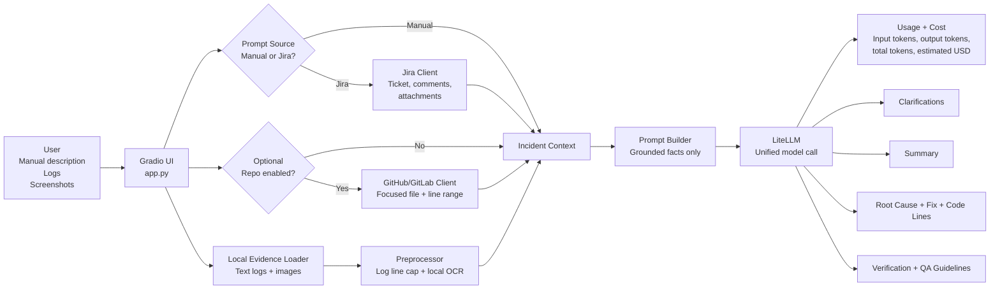

# AI Incident Analyzer

AI Incident Analyzer helps analyze software issues from manual error details,
logs, screenshots, Jira tickets, and focused GitHub/GitLab code context. It
builds a grounded prompt for the LLM and asks for clarifications, probable root
cause, recommended fixes, code lines to inspect, and verification steps.
LLM calls go through LiteLLM so the UI can show input tokens, output tokens,
total tokens, and estimated request cost.

The analyzer also includes pre-processing to reduce LLM cost:

- Very large logs are reduced before the LLM call by keeping only capped,
  high-signal line windows around error keywords.
- Screenshots are processed with local OCR first. If OCR is clear enough, only
  the extracted text is sent to the prompt. If OCR is missing or unclear, the
  screenshot is passed to the model as visual evidence.

## Solution Design

The project is split into a thin UI layer and reusable analysis/integration
modules:

- `app.py`: Gradio application. It collects manual incident details, uploaded
  logs or screenshots, and optional Jira/repository settings.
- `incident_analyzer.py`: Core orchestration. It builds the incident context,
  prepares the LLM prompt, attaches image evidence, invokes LiteLLM, and
  returns token/cost metadata.
- `integrations.py`: External system clients for Jira, GitHub, and GitLab.
  These clients fetch ticket details, comments, attachments, and code snippets.
- `preprocessing.py`: Cost-control and evidence extraction helpers. It trims
  oversized logs and runs local OCR against screenshots before the LLM call.
- `rca_generator.ipynb`: Notebook entry point for experimentation.

The integrations are optional in the UI:

- Prompt construction starts from either `Manual` or `Jira`, selected by the
  `Build Prompt From` toggle. Jira is used only when `Jira` mode is selected
  and a Jira key is supplied.
- GitHub/GitLab is used only when `Include GitHub/GitLab code context` is
  selected and repository details are supplied.
- Manual description, pasted logs, and uploaded files can be used by themselves
  in `Manual` mode.

## Architecture Diagram



## Flow

```text
User input
  |
  |-- Manual issue description
  |-- Pasted logs or stack trace
  |-- Uploaded .txt/.log/.json/.md files or screenshots
  |-- Prompt source toggle: Manual or Jira
  |-- Jira ticket key when Jira mode is selected
  |-- Optional GitHub/GitLab repo + file + line range
  |
  v
Gradio UI
  |
  v
Incident analyzer
  |
  |-- Loads local uploaded evidence
  |-- Reduces oversized logs to relevant capped line windows
  |-- Runs local OCR on screenshots before using image input
  |-- Fetches Jira summary, description, comments, and attachments when Jira mode is selected
  |-- Fetches focused repository code snippet if enabled
  |
  v
Prompt builder
  |
  v
LiteLLM call
  |
  |-- Captures input tokens, output tokens, total tokens, and estimated cost
  |
  v
Recommended fix
root cause
code lines to inspect
verification steps
QA guidelines
```

## Setup

Install dependencies from the repository root:

```powershell
pip install -r requirements.txt
```

For free local OCR, install the Tesseract OCR engine on your machine as well.
The Python package `pytesseract` is only a wrapper; it needs the local
Tesseract executable. If Tesseract is not installed or OCR confidence is low,
the app automatically falls back to passing the screenshot to the LLM.

Add the credentials you need to `.env` in the repository root:

```env
OPENAI_API_KEY=...
LITELLM_MODEL=openai/gpt-5-nano
# Backward-compatible fallback if LITELLM_MODEL is not set:
OPENAI_MODEL=gpt-5-nano

# Optional Jira integration
JIRA_BASE_URL=https://your-domain.atlassian.net
JIRA_EMAIL=you@example.com
JIRA_API_TOKEN=...
# or
JIRA_BEARER_TOKEN=...

# Optional repository integrations
GITHUB_TOKEN=...
GITLAB_TOKEN=...
```

For GitHub Enterprise or self-hosted GitLab, override the API URLs:

```env
GITHUB_API_URL=https://github.example.com/api/v3
GITLAB_API_URL=https://gitlab.example.com/api/v4
```

LiteLLM model names should include the provider prefix when possible, such as
`openai/gpt-5-nano`, `anthropic/claude-sonnet-4-5-20250929`, or
`ollama/llama2`. Bare OpenAI model names are automatically converted to
`openai/<model-name>` for backward compatibility.

Optional pre-processing defaults:

```env
MAX_LOG_LINES_FOR_LLM=400
LOG_CONTEXT_RADIUS=25
```

## Cost Control Behavior

Large pasted logs or uploaded log files can contain thousands of lines. Sending
all of them to the LLM can increase token usage and cost, so
`reduce_log_lines()` applies these rules:

1. If the log is within the configured cap, it is sent unchanged.
2. If the log is larger than the cap, lines around keywords such as `error`,
   `exception`, `failed`, `critical`, `traceback`, and `timeout` are retained.
3. Original line numbers are preserved in the compacted log.
4. If no error keywords are found, the function keeps the head and tail of the
   log and marks the middle as truncated.

Screenshot handling uses `ocr_image_file()` or `ocr_image_bytes()`:

1. The app tries free local OCR through Tesseract.
2. If OCR extracts enough readable text with acceptable confidence, only OCR
   text is sent to the LLM.
3. If OCR is unavailable, too short, or low confidence, the screenshot is sent
   to the LLM as image evidence.

## LiteLLM Token And Cost Tracking

The analyzer uses LiteLLM's Python SDK for model calls. LiteLLM returns an
OpenAI-compatible `usage` payload with prompt/input tokens, completion/output
tokens, and total tokens. The app also asks LiteLLM to estimate the request
cost for known models.

The Gradio UI includes a dedicated `Cost and Token Usage` section with:

- Model
- Input tokens
- Output tokens
- Total tokens
- Estimated cost in USD

If LiteLLM does not have pricing for a custom or self-hosted model, estimated
cost may show as `$0.000000` while token counts still display when the provider
returns usage.

## Run The Gradio UI

From the repository root:

```powershell
python -m ai_incident_analyzer.app
```

Open the URL printed by Gradio, usually:

```text
http://127.0.0.1:7860
```

## UI Usage

1. Enter the issue description in `Issue Description`.
2. Paste logs, stack trace, or failed job output in `Pasted Logs or Stack Trace`.
3. Upload `.txt`, `.log`, `.json`, `.md`, `.png`, `.jpg`, `.jpeg`, or `.webp`
   evidence if available.
4. Use `Build Prompt From` to switch between `Manual` and `Jira`.
5. In `Jira` mode, enter the Jira ticket key.
6. Select `Include GitHub/GitLab code context` only when you want code context
   from a repository.
7. Click `Submit Incident Analysis`.

## Python Example

Manual analysis only:

```python
from ai_incident_analyzer import analyze_incident

result = analyze_incident(
    incident_desc="Build fails after exporting source files.",
    error_logs="ERROR: Build error in ExportationRechercheContactsR.bas",
)

print(result.analysis)
print(result.usage)
```

Manual details plus Jira and GitHub context:

```python
from ai_incident_analyzer import analyze_incident

result = analyze_incident(
    incident_desc="Build fails after exporting source files.",
    error_logs="Unhandled error before On Error directive.",
    jira_key="PROJ-123",
    repository_provider="github",
    repository="owner/repo",
    file_path="src/import_export.py",
    ref="main",
    start_line=120,
    end_line=150,
    include_jira=True,
    include_repository=True,
)

print(result.analysis)
print(result.usage)
```

Manual details with local attachments:

```python
from ai_incident_analyzer import analyze_incident

result = analyze_incident(
    incident_desc="Deployment failed during database migration.",
    error_logs="See attached logs and screenshot.",
    local_attachment_paths=[
        "D:/incidents/deploy-error.log",
        "D:/incidents/failure-screen.png",
    ],
    include_jira=False,
    include_repository=False,
)

print(result.analysis)
print(result.usage)
```

## Expected Output

The LLM response is requested in this structure:

1. Clarifications
2. Summary
3. Probable Root Causes
4. Recommended Fix
5. Code Lines To Inspect
6. Verification Steps
7. QA Guidelines

The prompt tells the LLM to stay grounded in the supplied facts and to ask for
clarifying information when the evidence is incomplete.
